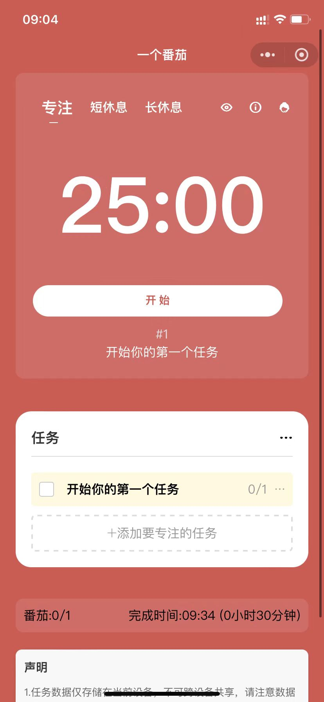
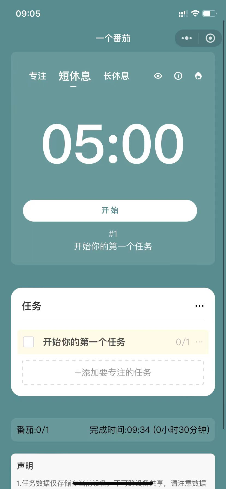
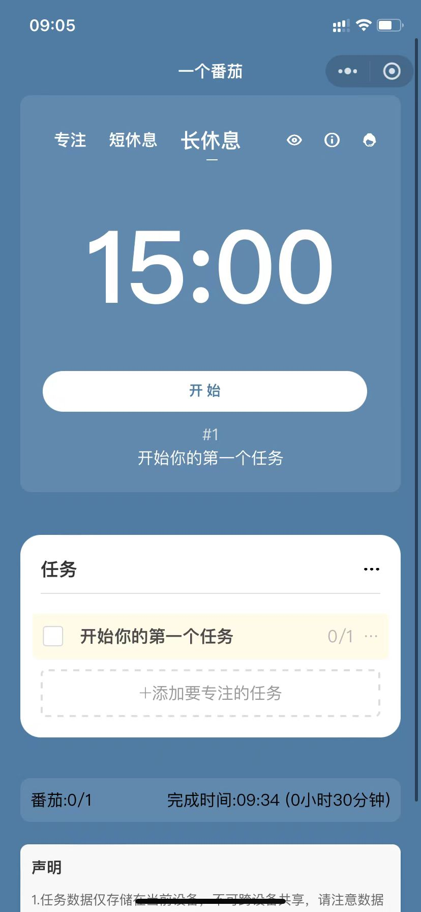
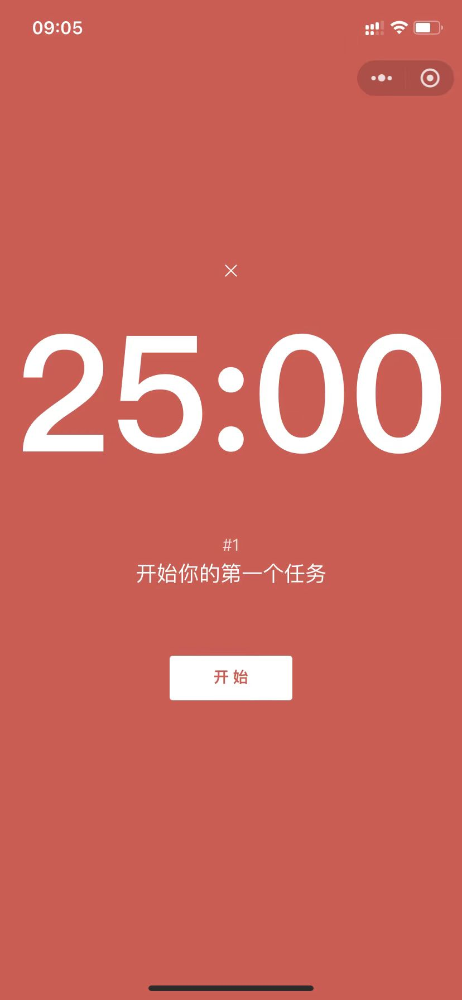
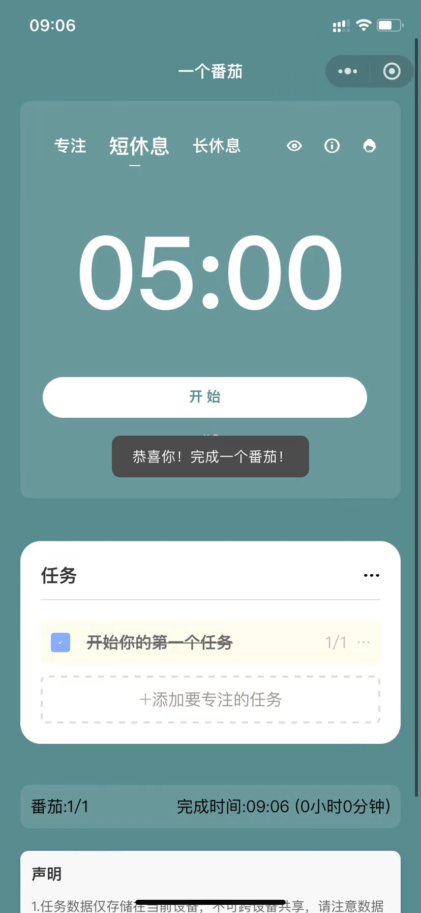

# myfocus番茄钟时间管理工具

## 项目简介

番茄钟时间管理工具是一款帮助用户提高工作和学习效率的应用。通过科学的专注与休息循环，让用户轻松达成目标。简洁的界面设计使其易于上手，是学生和职场人士提高效率的得力助手。

## 产品截图
<div style="display: flex; justify-content: space-between; flex-wrap: wrap;">
  
  
  
</div>
<div style="display: flex; justify-content: flex-start; flex-wrap: wrap; margin-top: 10px;">
  
  
</div>

## 主要功能

- 标准番茄钟计时（25分钟工作，5分钟短休息，15分钟长休息）
- 任务列表管理
- 任务关联执行番茄钟
- 任务结束时间提醒通知
- 白噪音背景音效


## 快速体验

### 小程序版


### pc版

您可以通过以下链接在线体验我们的番茄钟时间管理工具：

[myfocus番茄钟在线体验](https://myfocus.exanki.com)


## 技术栈

- 前端框架：uniapp
- UI 框架：uview
- 开发语言：Vue.js

## 快速运行


1. 克隆仓库
   ```
   git clone https://github.com/liwanzhong/myfocus.git
   cd myfocus
   ```

2. 安装依赖
   确保你已经安装了Node.js，然后运行：
   ```
   npm install
   ```

3. 配置开发环境
   - 下载并安装 [HBuilderX](https://www.dcloud.io/hbuilderx.html)
   - 打开HBuilderX，选择"文件" > "导入" > "从本地目录导入"，选择克隆的项目目录

4. 运行项目
   - 在HBuilderX中，点击工具栏的"运行" > "运行到浏览器" > 选择一个浏览器
   - 或者选择"运行" > "运行到小程序模拟器" > 选择对应的小程序平台

5. 调试和开发
   - 使用HBuilderX内置的调试工具进行代码调试
   - 修改代码后，HBuilderX会自动重新编译和刷新

6. 构建发布
   - 在HBuilderX中，点击"发行" > 选择目标平台（如"网站-H5"、"微信小程序"等）
   - 按照提示完成打包和发布流程

注意：首次运行可能需要配置各平台的开发者账号和相关设置，请参考uniapp官方文档进行相应配置。


## 使用指南

（见小程序的番茄钟最佳实践指南）


## 贡献指南

我们欢迎并感谢任何形式的贡献。如果您想为项目做出贡献，请遵循以下步骤：

1. Fork 本仓库
2. 创建您的特性分支 (`git checkout -b feature/AmazingFeature`)
3. 提交您的更改 (`git commit -m '添加一些新特性'`)
4. 将您的更改推送到分支 (`git push origin feature/AmazingFeature`)
5. 开启一个 Pull Request

## 许可证

本项目采用 GNU 通用公共许可证（GNU General Public License，简称 GPL）。详情请见 [LICENSE](LICENSE) 文件。